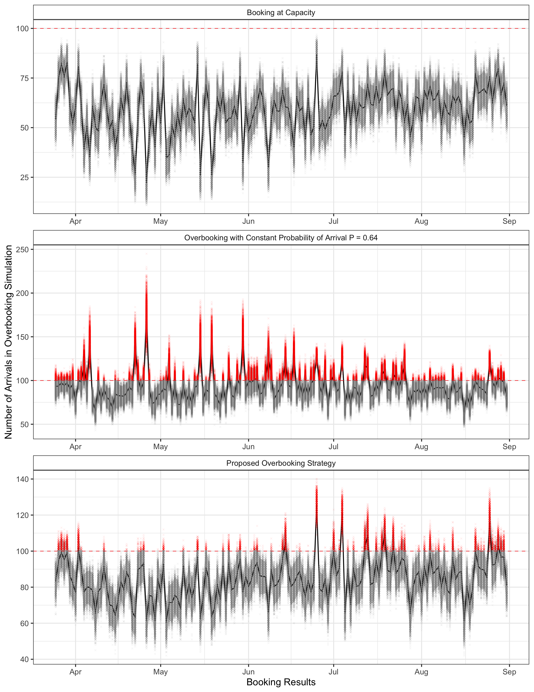

# Industrial Mathematics Project
#### Here we designed a hotel overbooking strategy and valadated it with Monte Carlo Simulations.

Find the final report [here](https://github.com/despresj/Industrial-Mathematics/blob/main/report/MTH843_proj.pdf)

## Figure 1 
#### Relationship between estimated probability of arrival and optimum bookings.

## Figure 2 
#### Overbooking strategy performance test.

# How it works
A guest making a hotel reservation is not certain to arrive. This uncertainty is defined as the probability of arrival p. A hotel will make many reservations and ask how many arrivals A to expect given the number of bookings b? The probability of b or fewer guests arriving follows a binomial distribution has a cumulative density function

$$
F(b|n,p)=P(X\leq b)=\sum _{i=0}^{k}{n \choose i}p^{i}(1-p)^{n-i}, A \leq b, 0 \leq 1.
$$

This function gives the probability of A or fewer guests arriving given the number of bookings, and probability of arrival. With this distribution, the total profit a hotel can expect while booking no more than capacity is

$$
\mathbb{E_b}[\operatorname{Total Profit}] = \pi\cdot b \cdot F(b|n,p),\ b \leq n, 0\leq p \leq 1.
$$

Where $\pi$ denotes profit per arrival. Multiply profit, number of bookings, and sum probability of each arrival to get expected profit. 

Booking over capacity allows fewer empty rooms, at the cost of risking arrivals exceeding capacity. The penalties associated with overbooking should be carefully considered. This strategy assumes that the cost of overbooking is providing each overbook additional accommodations at a cost of four times profit $L = 4\pi$. Now relax the assumption that bookings b is less than or equal to capacity k and obtain

$$E_b\left[\mathrm{Total\ Profit}\right]=\pi bF\left(k\middle| b,p\right)-L\left(b-k\right)\left(1-F\left(k\middle| b,p\right)\right),\ 0\le p\le1,\ \pi>0.$$

This model estimates profit for a given number of bookings, accounting for the possibility of arrivals exceeding capacity. To determine the maximum number of bookings by finding the amount of booing’s where $E_b\left[\mathrm{Total\ Profit}\right]>E_{b+1}\left[\mathrm{Total\ Profit}\right].$ Determine the number of bookings that maximize profit by solving this equation for b. Use an algorithm iterating over integer values of b starting at capacity and stopping when

See the source code [here](https://github.com/despresj/Industrial-Mathematics/blob/main/R/sim.R) for the implementation in R.
	
  The hotel booking data (Antonio 1) shows, on average, 64% of guests arrive.  Assume a 100-room hotel, the cost of overbooking is four times profit, and every guest has the same probability of arrival, maximize profit by booking 129 guests. The binomial distribution assumes that each p is the same for every trial. Assuming all customers have the same p, exposes the hotel to the inevitable event of booking too many customers highly likely to arrive and booking too few customers unlikely to arrive. The profitability of this strategy will depend on the ability to accurately estimate p for each reservation. Therefore, this strategy requires an estimate for p denoted by $\hat{p}$.
